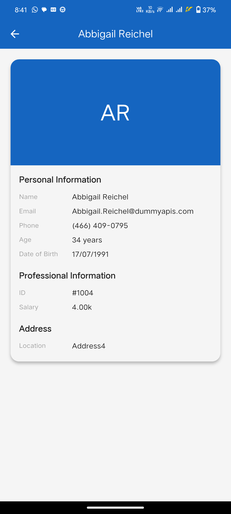

# Staff Sync

<p align="center">
  
</p>

## 📱 Overview

StaffSync is a Flutter application that demonstrates efficient employee data management with local caching capabilities. The app fetches employee data using Dio, implements proper error handling, and provides detailed employee information with a smooth user interface.

## ✨ Features

### Technical Features
- 🚀 Dio for API integration
- 💾 Local caching using SharedPreferences
- ⚡ Efficient error handling
- 🔄 Real-time employee data fetching
- 🔍 Advanced search functionality
- ⚡ Fast and responsive UI
- 📊 Multiple sorting options
- 🎨 Modern Material Design 3

### Employee Information
- 👤 Profile pictures with fallback initials
- 📧 Email addresses
- 📞 Formatted phone numbers
- 💰 Salary information
- 📍 Address details
- 📅 Age and DOB

### Built With
- Flutter
- Dart
- Material Design 3
- REST API

## Screenshots

| Staff Screen                             | Staff Details Screen                             |
|------------------------------------------|--------------------------------------------------|
|  |  |


### Dependencies
```yaml
dependencies:
  flutter:
    sdk: flutter
  dio:
  shared_preferences:
  cached_network_image:


