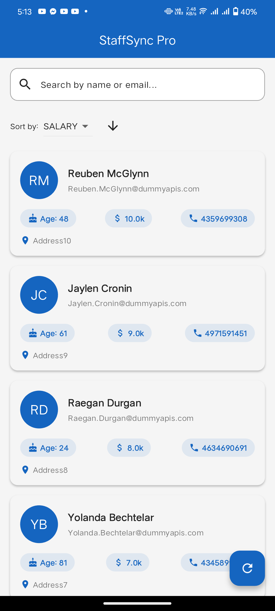

# staff_sync

<p align="center">
  
</p>

## 📱 Overview

StaffSync is a modern Flutter application designed for efficient employee directory management. It provides a clean and intuitive interface for viewing and managing employee information with features like real-time search, advanced sorting, and detailed employee profiles.

## ✨ Features

### Core Features
- 🔄 Real-time employee data fetching
- 🔍 Advanced search functionality
- ⚡ Fast and responsive UI
- 📊 Multiple sorting options
- 🎨 Modern Material Design 3

### Employee Information
- 👤 Profile pictures with fallback initials
- 📧 Email addresses
- 📞 Phone numbers
- 💰 Salary information
- 📍 Address details
- 🎂 Age

### User Experience
- ✨ Smooth animations
- ⚡ Fast loading states
- ❌ Error handling
- 🔄 Pull to refresh
- 📱 Responsive design

## 🛠️ Technical Details

### Built With
- Flutter
- Dart
- Material Design 3
- REST API

## Screenshots

| Staff Screen                             |
|------------------------------------------|
|  |


### Dependencies
```yaml
dependencies:
  flutter:
    sdk: flutter
  http: ^1.1.0
  cupertino_icons: ^1.0.2

